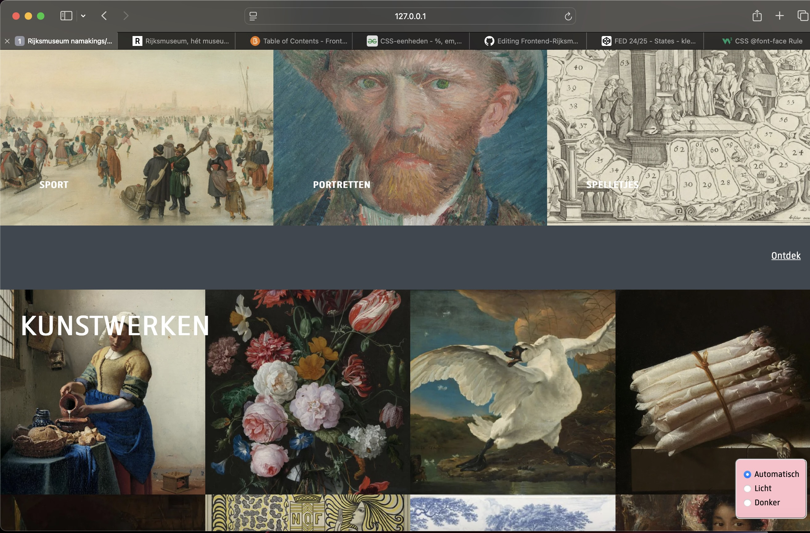
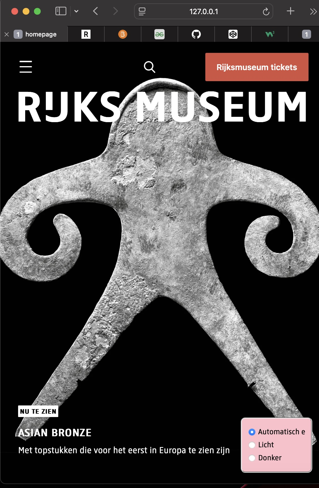
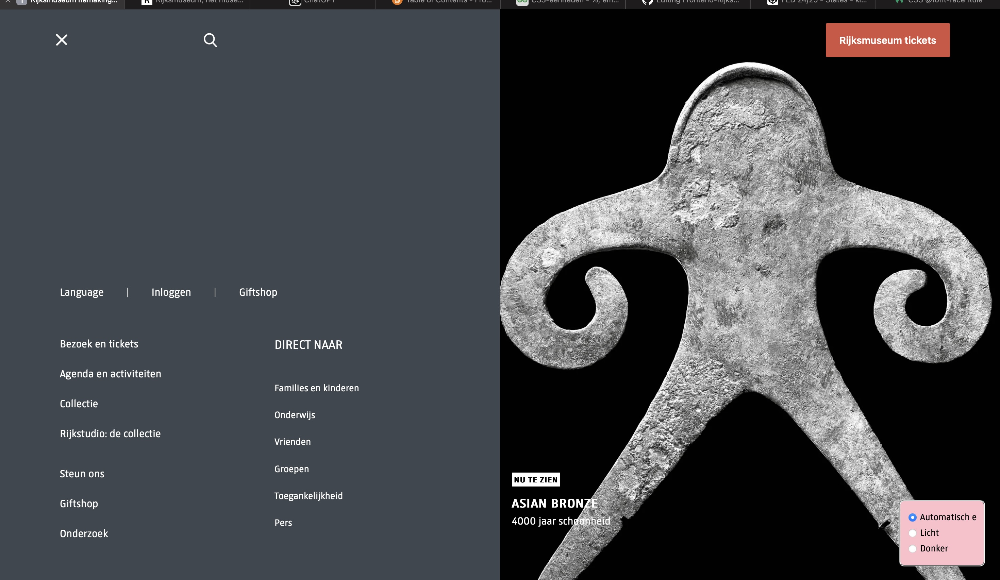

# Procesverslag
Markdown is een simpele manier om HTML te schrijven.  
Markdown cheat cheet: [Hulp bij het schrijven van Markdown](https://github.com/adam-p/markdown-here/wiki/Markdown-Cheatsheet).

Nb. De standaardstructuur en de spartaanse opmaak van de README.md zijn helemaal prima. Het gaat om de inhoud van je procesverslag. Besteedt de tijd voor pracht en praal aan je website.

Nb. Door *open* toe te voegen aan een *details* element kun je deze standaard open zetten. Fijn om dat steeds voor de relevante stuk(ken) te doen.

## Jij

  
uitwerken voor kick-off werkgroep

  ### Auteur:
  Yulan Staal

  #### Je startniveau:
  LichtBlauw

  #### Je focus:
  Responsive
 

## Je website

  
uitwerken voor kick-off werkgroep

  ### Je opdracht:
 https://www.rijksmuseum.nl/nl

  #### Screenshot(s) van de eerste pagina (small screen): 
  Home pagina
  

  #### Screenshot(s) van de tweede pagina (small screen):
  Collectie pagina
  
 

## Toegankelijkheidstest 1/2 (week 1)

  
uitwerken na test in 2e werkgroep

  ### Bevindingen
  Ik ben door de Rijksmuseum site gegaan en heb de screenreader hierop getest. Ik heb verschillende dingen getest. Zo heb ik gekeken wat er zou gebeuren als ik de voice over gewoon     zou laten voorlezen, ook heb ik geprobeerd om met mijn toetsenbord te navigeren en ook met behulp van mijn muis. Ik ben tot de volgende bevindingen gekomen:

  - Je kunt door de site heen scrollen door gebruik te maken van de spatie knop.
  - Met de tab kun je door de website navigeren, dit werkt niet overal even goed.
  - Goede hieracrhie van h1, h2 etc..
  - Niet overal gebruik gemaakt van goede alt teksten bij images.

## Breakdownschets (week 1)

  
uitwerken na afloop 3e werkgroep

  ### de hele pagina: 
  
  

  ### menu opengeklapt: 
  

  ### Collectie pagina: 
  

## Voortgang 1 (week 2)

  
uitwerken voor 1e voortgang

  ### Stand van zaken
  hier dit ging goed & dit was lastig (neem ook screenshots op van delen van je website en code)

  ### Agenda voor meeting
  samen met je groepje opstellen

  | Kyra                     | Pleuni            | Yulan                      | Tamara        |
  | ---                      | ---               | ---                        | ---           |
  | Flex of grid gebruiken   | :nth-of-type      | H1 in het midden krijgen   | en dan ik dat |

  ### Verslag van meeting
  hier na afloop snel de uitkomsten van de meeting vastleggen

  - Ik weet nu hoe ik mijn h1 in het midden krijg
  - Gebruik maken van aria-label
  - Font maken met @font face

## Voortgang 2 (week 3)

  
uitwerken voor 2e voortgang

  ### Stand van zaken
  hier dit ging goed & dit was lastig (neem ook screenshots op van delen van je website en code)

  ### Agenda voor meeting
  samen met je groepje opstellen

  | Pleuni                       | Kyra                   | Yulan          | Tamara           |
  | ---                          | ---                    | ---            | ---              |
  | Wat ipv classes gebruiken    | 3 style css bestanden  | h3 verbergen   |                  |

  ### Verslag van meeting
  hier na afloop snel de uitkomsten van de meeting vastleggen

  - Visually hidden gebruiken om elemenen onzichtbaar maken --> mijn h3
  - 3 css bestanden maken, 1 voor debasis style: root, fonts etc en 2 losse voor beide pagina's

## Toegankelijkheidstest 2/2 (week 4)

  
uitwerken na test in 9e werkgroep

  ### Bevindingen
  Lijst met je bevindingen die in de test naar voren kwamen (geef ook aan wat er verbeterd is):

## Voortgang 3 (week 4)

  
uitwerken voor 3e voortgang

  ### Stand van zaken
  hier dit ging goed & dit was lastig (neem ook screenshots op van delen van je website en code)

  ### Agenda voor meeting
  samen met je groepje opstellen
  
  | Kyra           | Pleuni                    | Yulan              | Tamara           |
  | ---            | ---                       | ---                | ---              |
  | Grid area      | Opstelling van slider     | Light/dark mode    | Afwezig          |
  | @media query   | Clamp font size           | Hoe werkt Grid     |                  |

  ### Verslag van meeting
  hier na afloop snel de uitkomsten van de meeting vastleggen

  - Weet nu hoe je light / dark mode toevoegt en hoe je daar buttons biij kunt maken
  - Duidelijker hoe media query's werken
  - Grid area in 1 regel ipv los grid-row-start grid-column-start etc. (Wel makkelijker voor mij om los uit te schrijven hihi)

## Eindgesprek (week 5)

  
uitwerken voor eindgesprek

  ### Je uitkomst - karakteristiek screenshots:
  
  
  

  ### Dit ging goed/Heb ik geleerd: 
  Ik heb over het algemeen enorm veel nieuwe kennis over CSS opgedaan, zo begrijp ik onder andere hoe je gebruik van een grid kunt maken en het werken met media query's. Ik was dit gehele vak erg onzeker en heb erg aan mezelf getwijfeld. Ik wist niet zeker of het me zou lukken om 2 pagina's te kunnen maken. Maar ik ben trots dat mijn beide pagina's staan en ook responsive goed werken. 

  

  ### Dit was lastig/Is niet gelukt:
  Over het algemeen vond ik bijna alles wel lastig, ik had het meeste moeite met mijn hamburger menu. Helaas is het me ook niet gelukt om deze volledig na te kunnen maken. Op klein scherm klopt hij, maar zodra het scherm groter wordt hoort een deel van de tekst die in het menu staat, naar de nav bar te verplaatsen. Dit is me helaas niet gelukt. Ook vond ik het maken van één bepaalde sectie in mijn collectie pagina extreem lastig, dit gaat over de 6e sectie in mijn main met meerdere artikelen. Ik had een idee van hoe ik dit moest doen, maar puntje bij paaltje heb ik hier meerdere dagen op vast gelopen. Gelukkig is het uiteindelijk goed gekomen en heb ik het nog kunnen fixen!

  

## Bronnenlijst

  
continu bijhouden terwijl je werkt

  Nb. Wees specifiek ('css-tricks' als bron is bijv. niet specifiek genoeg). 
  Nb. ChatGpT en andere AI horen er ook bij.
  Nb. Vermeld de bronnen ook in je code.

  1. Buttons https://www.codecenter.nl/pr/tutorial/css/css3_buttons#:~:text=CSS%20buttons%20groeperen&text=Verwijder%20de%20marges%20door%20aan,plaats%20je%20deze%20naast%20elkaar.
  2. Flexbox https://codepen.io/YulanS/pen/XWvwbJQ?editors=1100
  3. Grid https://www.w3schools.com/cssref/pr_grid-area.php
  4. Hamburgermenu https://www.w3schools.com/howto/howto_js_mobile_navbar.asp
  5. Grid https://codepen.io/YulanS/pen/bGXZOOL?editors=1100
  6. Grid https://www.w3schools.com/cssref/tryit.php?filename=trycss_grid-column-start
  7. Font face https://www.w3schools.com/cssref/atrule_font-face.php
  8. Font size https://www.geeksforgeeks.org/css-units-em-rem-px-vh-vw/
  9. Flexbox https://codepen.io/shooft/pen/xxozyVW?editors=1100
  10. Grid https://developer.mozilla.org/en-US/docs/Web/CSS/grid-template-columns
  11. Light/dark mode https://codepen.io/shooft/pen/xxozyVW?editors=1100
  12. Light/dark modehttps://dlo.mijnhva.nl/content/enforced/609316-FDMCI-2000FED121-DMCI-CMD-2425-1/FED%2024-25%20-%20Blok%202%20-%20Intro%20themes%20met%20has%20en%20lightdark.pdf

